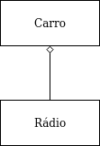
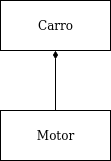
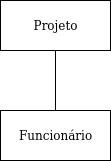
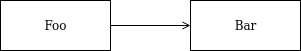

# UML Notations

## Disclaimer
Todo conteúdo apresentado nesse repositório representa o meu entendimento dos tópicos apresentados e não é a verdade absoluta. 

## Agregação
Agregação é uma forma de associação, esse relacionamento é caracterizado pelo conceito de todo/parte. Ex: Um carro possui um rádio.<br />

```
public class Carro {
  private Radio radio;
  public Carro(Radio radio) {
    this.radio = radio;
  }
}
```

## Composição
Composição é um tipo de agregação em que as partes morrem obrigatoriamente com o todo. Uma mesma parte não pode estar em diferentes todos. Os objetos da classe parte não existem independentemente da classe todo. Ex: Um carro é composto por um motor e esse motor não deve existir sem o carro.<br />

```
public class Carro {
  private Motor motor;
  public Carro() {
    this.motor = new Motor();
  }
}
```

## Associação
No dominío de um projeto existe um líder. Ex: Um projeto possui um funcionário que é o líder do projeto.<br />

```
public class Projeto {
  private Funcionario lider;
  public void setLider(Funcionario lider) {
    this.lider = lider;
  }
}
```

## Dependência
Segundo Martin Fowler, "In code terms, such things as naming a parameter type and creating an object in a temporary variable imply a dependency.". Ex: A classe Foo possui um metódo que recebe por paramêtro a classe Bar.<br />

```
public class Foo {
  public void Baz(Bar bar) {}
}
```

## Referência
[Post do Martin Fowler](https://martinfowler.com/bliki/DependencyAndAssociation.html)